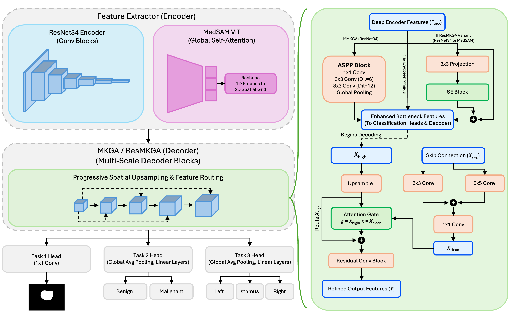

# Multi-Kernel Gated Decoder Adapters for Robust Multi-Task Thyroid Ultrasound

Official PyTorch implementation of **MKGA** for simultaneous thyroid nodule **segmentation**, **TIRADS classification**, and **anatomical position** prediction under cross-center shift.

**Paper:** [arXiv:2603.08906](https://arxiv.org/abs/2603.08906)

<p align="center">
  
</p>

## Project structure

```
MKGA/
├── mkga/                  # Core Python package
│   ├── dataset.py         # ThyroidDataset and augmentations
│   ├── paths.py           # Path helpers
│   ├── models/            # ResNet34, MedSAM, and MKGA variants
│   └── optim/             # PCGrad optimizer wrapper
├── images/                # Figures for documentation
├── docs/                  # Dataset format specification
├── train.py               # Training entry point
├── test.py                # Evaluation entry point
├── scripts/               # Batch experiment runners
├── weights/               # MedSAM pretrained weights (not committed)
├── checkpoints/           # Saved models (gitignored)
└── results/               # Evaluation CSVs (gitignored)
```

## Setup

```bash
cd MKGA
python -m venv .venv
source .venv/bin/activate
pip install -e .
pip install -r requirements.txt
pip install git+https://github.com/facebookresearch/segment-anything.git
```

Download [MedSAM ViT-B](https://github.com/bowang-lab/MedSAM) weights to `weights/medsam_vit_b.pth`.

## Data layout

Set `MKGA_DATA_ROOT` to the directory that **contains** a `Dataset/` folder (not the `Dataset/` folder itself):

```bash
export MKGA_DATA_ROOT=/path/to/your/data
```

Example layout:

```
/path/to/your/data/
└── Dataset/
    ├── ThyroidXL/
    │   ├── stats/id2info_eng_clean.json
    │   ├── train/images/, train/masks/
    │   └── test/images/, test/masks/
    └── DDTI/
        ├── stats/ddti_dataset.json
        ├── train/images/, train/masks/
        └── test/images/, test/masks/
```

Alternatively, pass `--data_root /path/to/parent` on every command.

For the full JSON schema, field definitions, and label encoding rules, see **[docs/DATA_FORMAT.md](docs/DATA_FORMAT.md)**.

## Training

```bash
python train.py \
  --model ResNet34_MKGA \
  --source ThyroidXL \
  --epochs 100 \
  --batch_size 16
```

**Models:** `ResNet34`, `ResNet34_MKGA`, `ResNet34_ResMKGA`, `SAM`, `SAM_MKGA`, `SAM_ResMKGA`

**Key flags:** `--use_lora`, `--lora_rank`, `--freeze_resnet`, `--use_pcgrad`, `--use_uncertainty`, `--use_mixstyle`, ablation toggles (`--ablate_gate`, `--ablate_multi`, `--ablate_se`, `--kernel_combo`)

Checkpoints are saved to `checkpoints/`.

## Evaluation

```bash
python test.py \
  --model ResNet34_MKGA \
  --test_on DDTI \
  --path checkpoints/ResNet34_MKGA_Frac1.0.pth
```

Results are written to `results/` as CSV files (`*_seg.csv`, `*_tirads.csv`, `*_pos.csv`).

## Batch scripts

Scripts auto-detect `Dataset/` in the parent of the MKGA repo when `MKGA_DATA_ROOT` is unset. You can also set it explicitly:

```bash
export MKGA_DATA_ROOT=/path/to/your/data
bash scripts/run_train.sh
bash scripts/run_test.sh
bash scripts/run_ablations.sh
```

Override ablation training length:

```bash
ABLATION_EPOCHS=100 ABLATION_PATIENCE=15 bash scripts/run_ablations.sh
```

## Citation

If you use this code, please cite:

```bibtex
@misc{sabouri2026multikernelgateddecoderadapters,
      title={Multi-Kernel Gated Decoder Adapters for Robust Multi-Task Thyroid Ultrasound under Cross-Center Shift},
      author={Maziar Sabouri and Nourhan Bayasi and Arman Rahmim},
      year={2026},
      eprint={2603.08906},
      archivePrefix={arXiv},
      primaryClass={cs.CV},
      url={https://arxiv.org/abs/2603.08906},
}
```

## License

This project is licensed under the MIT License — see the [LICENSE](LICENSE) file for details.

The MIT License is a highly permissive open-source license. You are free to use, modify, and redistribute this code (including for commercial purposes), provided that the original copyright notice and license text are included. It is a standard choice for academic ML research code.

*Note for contributors/collaborators: If your institution requires a different policy (e.g., non-commercial or GPL), please ensure the LICENSE file is updated accordingly before public release.*
